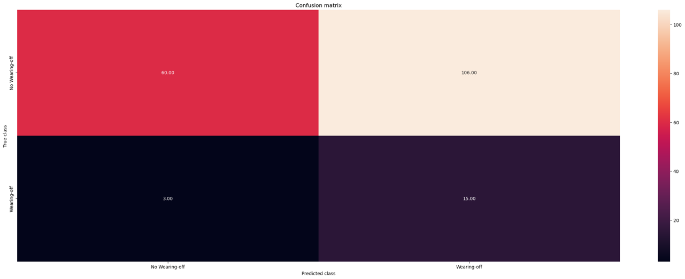

<!-- _header: " " -->
<!-- _class: lead -->
# Poster Presentation
#### May 2023

 

**VICTORINO John Noel**

---
<!-- _header: Overview for May -->
* **ABC 2023 Paper:** Handling Class Imbalance with Non-Uniform Negative Sampling, Log Odds Correction, and Oversampling in Forecasting Parkinson's Disease Wearing-off with Fitness Tracker Dataset
  * Paper: In Progress
  * Code & Results: In Progress
  * Presentation: for May 2023 Poster Presentation

---
<!-- _header: Proposed Method -->
$$
\begin{array}{l}
\hline
  \text{\textbf{Forecasting Wearing-off} using \textbf{Negative Sampling and Log Odds Correction}} \\
\hline
\text{1. Train ``pilot model" using uniform sampling of both classes with equal sample sizes.} \\
\text{1. Score data using pilot model.} \\
\text{2. Sample data using \textbf{Negative Sampling}}. \\
\text{3. Correct likelihod using \textbf{Log Odds Correction}}. \\
\hline
\end{array}

$$

* **Contributions**
  * Application of Negative Sampling and Log Odds Correction to assign larger probabilities to more informative instances, i.e., wearing-off labels and informative normal labels.
  * Improves forecasting of wearing-off by *X%* as compared to ABC 2022 paper.
* **Paper category**: Application-based paper

---
<!-- _header: Forecasting Wearing-off Task -->
* **Wearing-off** is a phenomenon where the effect of a drug wears off before the next dose is taken.

* Let $\{(X_t, y_t)\}_{t=1}^{N}$ be the training data that satisfies 
$$
Pr(y_{t + 1} = 1 | M) = p(M; \theta),
% Read as: Probability of y + 1 hour is a function of M and theta
M = \begin{bmatrix}
    X_{t},   & y_{t}   \\
    \vdots  & \vdots   \\
    X_{t - 1 \text{hour}}, & y_{t - 1 \text{hour}}  \\
\end{bmatrix}
$$

- $y \in \{0, 1\}$ is wearing-off (1) or not (0),
- $M$ is the feature matrix of X and y from the last hour until time $t$,
- $\theta$ is the model parameters

---
<!-- _header: Forecasting Wearing-off Task -->
For example, if the dataset is in 15-minute interval.

* Forecast: $y_{t + 4}$
* Input: 
$$
  M = \begin{bmatrix}
  X_{t}   & y_{t} \\    
  X_{t-1} & y_{t-1} \\
  X_{t-2} & y_{t-2} \\
  X_{t-3} & y_{t-3} \\
  X_{t-4} & y_{t-4} \\
  \end{bmatrix}
$$

---
<!-- _header: Imbalance in Wearing-off Dataset -->

<!-- class: split -->

#### Wearing-off Statistics
- Mean: 8.276%
- Median: 7.682%
- Standard Deviation: $\pm$ 3.624
- Participants Below Median: 1, 2, 7, 9, 12, 13
- Participants Equal / Above Median: 3, 4, 5, 6, 8, 10, 11

| Participant | Normal ($y = 0$) | Wearing-off ($y = 1$) |
| :-: | -------: | ------: |
|  1  |  92.361  |  7.639  |
|  2  |  97.348  |  2.652  |
|  3  |  86.771  |  13.229 |
|  4  |  90.492  |  9.508  |
|  5  |  92.318  |  7.682  |
|  6  |  89.815  |  10.185 |
|  7  |  98.821  |  1.179  |
|  8  |  87.973  |  12.027 |
|  9  |  92.992  |  7.008  |
|  10 |  86.771  |  13.229 |
|  11 |  90.705  |  9.295  |
|  12 |  92.519  |  7.481  |
|  13 |  93.528  |  6.472  |

---
<!-- _header: Imbalanced Data Definition -->
<!-- class: " " -->
* Let $N_1$ wearing-off cases, $N_0$ normal cases, and $N = N_1 + N_0$ total cases.
* When $N_1$ much smaller than $N_0$, appropriate to assume that $N_1$ increases in slower rate compared with $N_0$, i.e.,
$$
\frac{N_1}{N_0} \xrightarrow{P} 0 \text{ and } N_1 \xrightarrow{P} \infty \text{ as } N \rightarrow \infty
% read as: 
% N_1 / N_0 converges to 0 in probability
% N_1 converges to infinity in probability
$$
* This requires that $Pr(y_{t+1} = 1) \rightarrow 0$ as $N \rightarrow \infty$ on model side.
<!-- This requires us that the probability of positive cases depends on the sample size -->

---
<!-- _header: Imbalanced Data Definition -->

Assume that $\theta = (\alpha, \beta^T)^T$, log odds is as follows:
$$
  g(M; \theta) := \log\{ \frac{p(M; \theta)}{1 - p(M; \theta)} \} = \alpha + f(M; \beta)
  % read as: log-odds g with 2 parts
  % 1st part is intercept alpha, assume that it goes to negative infinity p of y = 1 goes to 0
  % 2nd part is function f, assume that Beta is fixed 
$$

* $f(M; \beta)$ is the smooth function of $\beta$, e.g., neural network or logistic regression.
* The true parameter $\theta^* = (\alpha*, {\beta^*}^T)^T$ with assumption that
  * $\alpha^* \rightarrow -\infty$ as $N \rightarrow \infty$,
  * $\beta^*$ is essentially fixed, as long as $\beta^*$ has a finite limit
* For both assumptions indicate that marginal & conditional probabilities of positive instance are **small**.
* This means that changes in covariates do not convert small probability event to large probability event.

---
<!-- _header: Number of Positive Instance Matter -->

* For rare event, estimation error rate for $\theta$ is related to $N_1$ instead of $N$.
* Using the full training data, maximum likelihood estimator (MLE) of $\theta$ is

$$
\DeclareMathOperator*{\argmax}{argmax}

\hat{\theta}_{MLE} := \argmax_{\theta} \sum_{i=1}^{N} \{ y_{{t+1}_i} \cdot g(M_i; \theta) - \log (1 + e^{g(M_i; \theta)}) \}
$$

---
<!-- _header: (1) Negative Sampling -->
* **Keep all wearing-off instances while significantly subsampling negative instances**, since available information ties with wearing-off instances instead of full training data.
  * **Uniform sampling**: keeping the ratio of positive to negative samples.
  * Reduce the number of negative samples using **nonuniform sampling**.
  
---
<!-- _header: (1) Negative Sampling -->

$$
\begin{array}{l}
\hline
  \text{\textbf{Algorithm 1}: Negative Sampling} \\
\hline
\text{For } i = 1, \dots, N: \\
\hspace{1em} \text{if } y_{{t+1}_i} = 1, 
  \text{include }
  \{ M_i, y_{{t+1}_i}, \pi(M, y_{{t+1}}) = 1 \}
  \text{ in the sample. } \\
\hspace{1em} \text{if } y_{{t+1}_i} = 0, 
  \text{include }
  \{ M_i, y_{{t+1}_i}, \pi(M, y_{{t+1}}) = \rho \varphi(M) \ \}
  \text{ in the sample }  \\
\hspace{2em} \text{if } u_i \le \rho \varphi(M), \text{where generate } u_i \sim \mathbb{U}(0, 1).\\
\hline
\end{array}

$$

* $\rho$: sampling rate on negative instances.
* $\pi(M, y_{t+1})$: sampling probability for given $(M, y_{{t+1}})$.
  * $\pi(M)$: sampling probability for negative cases, as shorthand.
* $\varphi(M)$: "pilot model" from uniform sampling of both classes with equal sample sizes.
* $\delta = 1$ if data point is selected; otherwise, $\delta = 0$.

---
<!-- _header: (2) Log Odds Correction -->

Recap...

$$
Pr(y_{t + 1} = 1 | M) = p(M; \theta) = \frac{1}{1 + e^{-g(M; \theta)}},
$$

$$
\DeclareMathOperator*{\argmax}{argmax}

\hat{\theta}_{MLE} := \argmax_{\theta} \sum_{i=1}^{N} \{ y_{{t+1}_i} \cdot g(M_i; \theta) -
  \log(1 + e^{g(M_i; \theta)}) \} 

$$

For the **Log Odds Correction**, for the data included in the subsample (where $\delta = 1$), the conditional probability of $y_{t+1} = 1$

$$
Pr(y_{t + 1} = 1 | M, \delta = 1) = \frac{1}{1 + e^{-g(M; \theta) - l}}, \text{where } l = -\log \{ \pi(M) \}
$$

$$
\hat{\theta}_{lik} := \argmax_{\theta} \sum_{i=1}^{N} \delta_i [ y_{{t+1}_i} \cdot g(M_i; \theta) -
  \log \{ 1 + e^{g(M_i; \theta) + l_i} \} ] 
$$

This is done to
* avoid assigning smaller weights to more informative instances
* avoid biased estimator due to Algorithm 1

---
<!-- _header: Summary of Method -->

$$
\begin{array}{l}
\hline
  \text{\textbf{Forecasting Wearing-off} using \textbf{Negative Sampling and Log Odds Correction}} \\
\hline
\text{1. Train ``pilot model" using uniform sampling of both classes with equal sample sizes.} \\
\text{1. Score data using pilot model.} \\
\text{2. Sample data using \textbf{Algorithm 1: Negative Sampling}}. \\
\text{3. Correct likelihod using \textbf{Log Odds Correction}}. \\
\hline
\end{array}

$$

---
<!-- _header: Initial Results - Base XGBoost Estimator -->

* Base XGBoost

 
 

* Proposed Method should:
  * Reduce negative samples and as a result improve the performance of the model.
  * Boost probabilities from positive samples.

---
<!-- _header: Initial Results - Proposed Negative Sampling with Log Odds Correction -->

* Proposed Negative Sampling with Log Odds Correction

<!--  -->

 
 

* However, results have not improved the model on F1 score and forecasts:
  * There might be discrepancy between the reference papers vs implementation.

---
<!-- _header: Comments from Inoue-sensei's Poster Presentation -->

* Is the test data resampled or kept the same? (latter is realistic)
  * **ANS**: Test data is kept the same.
* Why do you want to apply the proposed method (negative sampling and log odds correction)?
  * **ANS**: Because under binary model with rare event data, the difference between **full data estimator** & **true parameter** converge to a normal distribution with similar rate to the number of **rare positive cases, i.e., wearing-off**. As such, subsampling the negative instances, i.e., normal cases, is justified.
  * If uniform sampling (equal number of classes) is used, there is **information loss**. This is the reason for the **log odds correction** as it gives more weight to samples with higher probability of being positive, keeping samples that confuses the model, and learns to separate true positive from negative samples that are similar to positive samples.

* Aren't there other class imbalance techniques to try? If so, which should be baseline?
  * **ANS**: Looking into this area as part of the RRL.

---
<!-- _header: Next Steps -->
* Finish ABC paper (if forecast results have improved.)
* Otherwise, try to improve forecast results using other methods previously studied.
  * Inoue-sensei's suggestion: look into **adaptive resampling**.
  * Then, submit to journal.
* Prepare data collection experiment using new Garmin App Collector to include
  * Accelerometer, HRV
  * Active feedback of patients from forecasts
* Development work on Pose Estimation using Jetson Nano.
* Work on Additional tasks due to ABC 2023 challenge.
