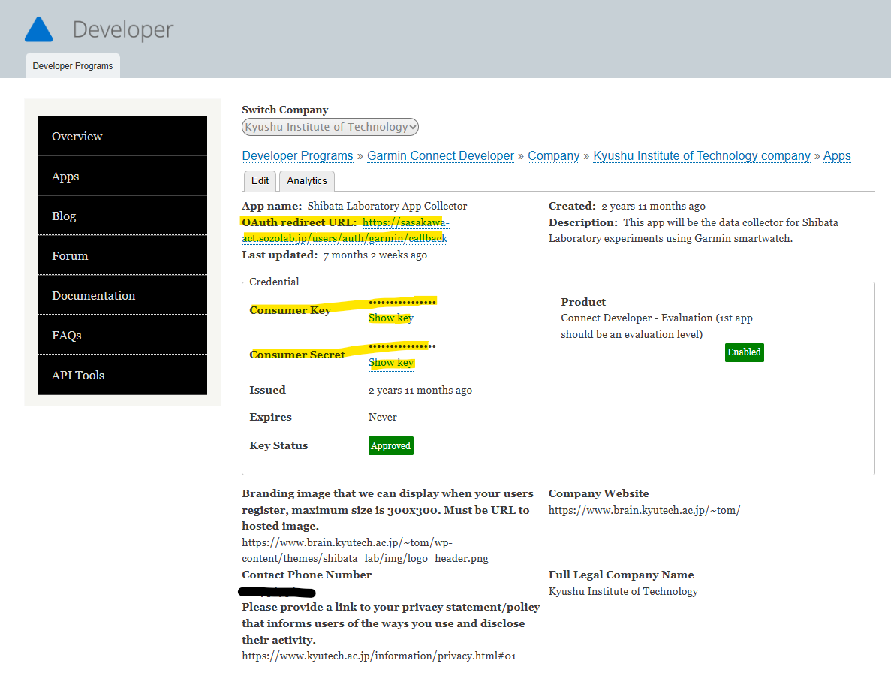

# README

## Prerequisites

* [Docker](https://docs.docker.com/get-started/overview/)
* [Garmin Developer Account](https://developerportal.garmin.com/developer-programs)

## Setup

After cloning the project,

```bash
chmod +x start
cp ./config/database.yml.example ./config/database.yml
```

Replace `project_name` with your own project name.

```bash
cp .env.example .env
```

* Build the Docker containers.

```bash
docker compose build
```

* Install the gems specified in the ``Gemfile``.

```bash
docker compose run --rm web bundle install --without production
```

* Create database.

```bash
docker compose run --rm web rails db:create
```

* Seed db dump
```bash
docker compose run --rm db bash
cd /home/user/db/data/
PGPASSWORD=<POSTGRES_PASSWORD from .env> pg_restore -O -h db -U <POSTGRES_USER from .env> -d garmin_development garmin_production_<db dump timestamp>.tar
exit
```
For example, 
```
PGPASSWORD=postgres pg_restore -O -h db -U postgres -d garmin_development garmin_production_03262025_1647.tar
```

* Check for database migration (if any)
```bash
docker compose run --rm web rails db:migrate
```

## Local Development

* Start server in machine
```bash
rm tmp/pids/server.pid ; docker compose up
```

* Stop server
```bash
docker compose down ; rm tmp/pids/server.pid
```

* To login with the local development, update `app/controllers/users_controller.rb`. Comment Line 2
```ruby
# before_action :authenticate_user!
```

## Deployment

* Create `config/keys` folder.
* Place the private SSH key inside the `config/keys` folder.
* Inside the local machine, run the following command.
```bash
docker compose exec web bash
cap production deploy branch=main
```

* Inside the AWS server, to update Inference Server, [Reference](https://dev.to/shuv1824/deploy-fastapi-application-on-ubuntu-with-nginx-gunicorn-and-uvicorn-3mbl).
```bash
cd /home/ubuntu/garmin/current/
docker compose up fastapi
```

### Useful Docker commands
* `docker compose up fastapi` - starts the server but not running in the background
* `docker compose up -d fastapi` - starts the server in the background
* `docker ps` - list down running docker container
* `docker compose logs -f fastapi` - monitor logs from running container

## Gem Checklist

### For Main Application
* [Better Errors](https://github.com/charliesome/better_errors)
* [Bootstrap Ruby Gem](https://github.com/twbs/bootstrap-rubygem)
* [Bootstrap Layouts](https://getbootstrap.com/docs/4.1/examples/)
* [Simple Form](https://github.com/plataformatec/simple_form)
* [Devise](https://github.com/plataformatec/devise)
* [Filterrific](http://filterrific.clearcove.ca/)
* [Select2-Rails](https://github.com/argerim/select2-rails)

## For Admin
* [ActiveAdmin](https://github.com/activeadmin/activeadmin) - for Admin's CMS
* [ActiveAdmin Addons](https://github.com/platanus/activeadmin_addons) - for additional features for ActiveAdmin
* [Capistrano](https://capistranorb.com/documentation/getting-started/authentication-and-authorisation/)

## For Garmin User OAuth
* [Omniauth-Garmin](https://github.com/naveed-ahmad/omniauth-garmin)
* [Setup Devise with Omniauth](https://github.com/heartcombo/devise/wiki/OmniAuth:-Overview)
* [Typheous](https://engineering.wework.com/ruby-users-be-wary-of-net-http-f284747288b2)

## Garmin Developer Portal

Access to [Garmin Developer Portal]([Title](https://developerportal.garmin.com/developer-programs)) is **required** because the URL of the server should be updated in the account.


